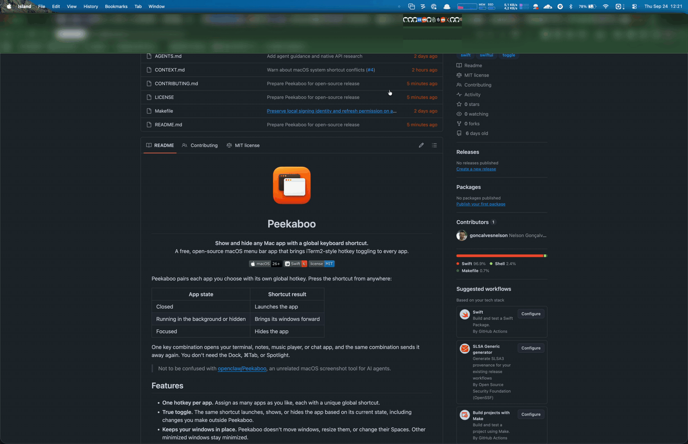

<p align="center">
  
</p>

<h1 align="center">Peekaboo</h1>

<p align="center">
  <strong>Show and hide any Mac app with a global keyboard shortcut.</strong><br>
  A free, open-source macOS menu bar app that brings iTerm2-style hotkey toggling to every app.
</p>

<p align="center">
  
  
  <a href="LICENSE"></a>
</p>

Peekaboo pairs each app you choose with its own global hotkey. Press the shortcut from anywhere:

| App state | Shortcut result |
| --- | --- |
| Closed | Launches the app |
| Running in the background or hidden | Brings its windows forward |
| Focused | Hides the app |

One key combination opens your terminal, notes, music player, or chat app, and the same combination sends it away again. You don't need the Dock, ⌘Tab, or Spotlight.

<p align="center">
  
</p>

> Not to be confused with [openclaw/Peekaboo](https://github.com/openclaw/Peekaboo), an unrelated macOS screenshot tool for AI agents.

## Features

- **One hotkey per app.** Assign as many apps as you like, each with a unique global shortcut.
- **True toggle.** The same shortcut launches, shows, or hides the app based on its current state, including changes you make outside Peekaboo.
- **Keeps your windows in place.** Peekaboo doesn't move windows, resize them, or change their Spaces. Other minimized windows stay minimized.
- **Restores the right window.** With Accessibility access, Peekaboo brings back the window you used most recently, even if it was minimized.
- **Warns about macOS shortcut conflicts.** Peekaboo checks new shortcuts against the enabled combinations in System Settings → Keyboard Shortcuts, and you can choose **Use Anyway**.
- **Record shortcuts by pressing them.** Labels follow your keyboard layout, including special keys such as Space, arrows, and F1–F20.
- **Native and lightweight.** Built with Swift, SwiftUI, AppKit, and Carbon hotkeys. No third-party dependencies, no Dock icon, and no network access.
- **Private by design.** No Input Monitoring permission, no analytics, and all configuration stays in one local JSON file.

## Requirements

- macOS 26 or later
- Xcode 26 to build from source

No Apple Developer account, paid membership, or Homebrew packages are needed.

## Install

Peekaboo is distributed as source. Build and install it with your own local signing certificate:

```sh
git clone https://github.com/goncalvesnelson/Peekaboo.git
cd Peekaboo
make install
open /Applications/Peekaboo.app
```

Check that Xcode's developer directory is selected before building. `xcode-select -p` should point inside Xcode, such as `/Applications/Xcode.app/Contents/Developer`, not the standalone Command Line Tools directory. Open Xcode once to finish its installation.

The first build creates a local code-signing certificate in your login Keychain. If macOS asks whether `codesign` can use the key, choose **Always Allow**. [Signing details](#signing) explains why this is needed.

## Usage

### Assign an app to a shortcut

1. Click the Peekaboo icon in the menu bar and choose **Settings…**.
2. Click **Add App…** and choose an installed `.app`. The app doesn't need to be running.
3. Click **Record shortcut**, press a key together with Command, Control, or Option, and release it to save.

Press Escape, click the field's cancel icon, close Settings, or switch to another app to cancel recording. Peekaboo pauses its own shortcuts while you record, then turns them back on.

### Edit or remove an assignment

- Click an assignment's shortcut field to record a new combination. If the new shortcut can't be registered, the previous one keeps working. Recording the same shortcut again retries a failed registration.
- Click the app's name or icon to select a different copy of the app.
- Click the **trash button** to remove the assignment and release its shortcut.

Each shortcut must be unique within Peekaboo.

### Allow Accessibility (optional)

Launching, showing, and hiding apps work without extra permissions. To restore the most recently used window when it is minimized, click **Allow Accessibility…** in Settings and enable Peekaboo in **System Settings → Privacy & Security → Accessibility**. Peekaboo rechecks the permission when you switch apps, so the menu bar icon updates when you leave System Settings.

### macOS system shortcut conflicts

Before saving, Peekaboo compares the recorded combination with the shortcuts enabled in macOS Keyboard Shortcuts, even when the combination is unchanged. If there is a match, a native warning offers **Cancel**, **Open Keyboard Shortcuts…**, and **Use Anyway**:

- **Cancel** keeps the previous assignment.
- **Open Keyboard Shortcuts…** also keeps the previous assignment and opens System Settings → Keyboard → Keyboard Shortcuts. macOS doesn't report which action owns a combination, so find it there, then record the shortcut again.
- **Use Anyway** saves using the existing registration when the shortcut is unchanged and still registered. Otherwise, it attempts a native registration and saves only if that succeeds.

If you leave the warning unanswered, the menu bar shows why its warning icon is displayed. If macOS can't report its shortcuts, Peekaboo says the check is unavailable and leaves the assignment unchanged. Record the shortcut again to retry.

The check covers enabled system shortcuts that macOS reports. It doesn't cover shortcuts defined inside individual apps. A successful registration doesn't guarantee that macOS or another app won't intercept the combination first.

## How it behaves

Each completed shortcut press requests one toggle. Peekaboo checks the app's current state every time and ignores repeated presses while a launch is still in progress.

- **Hidden apps** hidden with ⌘H are brought forward.
- **Minimized windows:** with Accessibility access, the most recently used window is restored if it is minimized. Other minimized windows stay minimized. A focused app whose windows are all minimized is restored instead of hidden.
- **Apps without standard windows** are hidden when focused.
- **Spaces:** macOS controls Space switching. Peekaboo never moves windows between Spaces.
- **Window history** starts once Accessibility access is available and isn't saved across restarts. If an app has several windows and none was used recently, Peekaboo asks you to open the one you want instead of guessing. If a focus update is missed, Peekaboo may restore an older window until it sees focus change again.
- **Keyboard layouts:** shortcuts use physical key codes. Labels reflect the layout active when you recorded them. Re-record a shortcut if you switch layouts and want a different physical key.
- **Errors** appear in Settings and in the menu bar. An error for one assignment never disables the others, and a toggle error clears after that assignment's next successful toggle. Settings actions and toggles for other assignments don't clear it, and you can dismiss it.

A successful native request doesn't guarantee immediate focus. Peekaboo reports requests that macOS rejects.

### Where assignments are stored

Assignments are stored at `~/Library/Application Support/AppToggle/assignments.json`. Each one targets the specific app copy you selected, identified by its file URL and bundle identifier. If that copy moves or disappears, select it again. Peekaboo won't silently launch a different copy.

The storage directory and bundle identifier (`com.nelsongoncalves.AppToggle`) keep the project's original name, so existing assignments and the app's identity survive the rename.

The file is replaced atomically on every write. If it can't be read, Peekaboo blocks changes to protect it; fix the reported problem and choose **Reload Saved Assignments**. A failed write leaves the previous file intact.

## Development

```sh
make certificate # Set up or check the local signing certificate
make build       # Debug build
make run         # Open the Debug app
make check       # Build and run all tests
make app         # Signed Release app in .build/Build/Products/Release
make install     # Install the Release app in /Applications
```

- Use `make install PREFIX=/another/existing/directory` to install somewhere else. Quit and reopen Peekaboo to use a newly installed build.
- Swift and Clang treat warnings as errors.
- The commands use the shared `Peekaboo` scheme, a macOS destination matching the host architecture, and `.build/` for derived data.
- Tests use temporary configuration files. The test host sets `PEEKABOO_TESTING=1`, so it never restores your own assignments or registers their shortcuts.

The underlying commands on Apple silicon are:

```sh
xcodebuild -project Peekaboo.xcodeproj -scheme Peekaboo -destination 'platform=macOS,arch=arm64' -derivedDataPath .build SWIFT_TREAT_WARNINGS_AS_ERRORS=YES GCC_TREAT_WARNINGS_AS_ERRORS=YES -configuration Debug build
xcodebuild -project Peekaboo.xcodeproj -scheme Peekaboo -destination 'platform=macOS,arch=arm64' -derivedDataPath .build SWIFT_TREAT_WARNINGS_AS_ERRORS=YES GCC_TREAT_WARNINGS_AS_ERRORS=YES -configuration Debug test
```

Automated tests don't prove that global shortcuts are physically delivered, or how windows and Spaces behave. [Native checks](docs/native-checks.md) lists the interactive steps and the results recorded so far. [Native macOS API research](docs/research/native-macos-apis.md) describes the APIs Peekaboo relies on and their limits.

### Signing

Accessibility grants are tied to the app's code signature, so a stable signing identity means you don't have to grant access again after every update.

Before building or testing, Make looks for a signing identity named **Peekaboo Local Development**. If there isn't one, `scripts/setup-signing.sh` uses macOS's `openssl` and `security` tools to create a certificate and private key in your login Keychain. It then trusts that certificate for code signing for your user only.

- **Permissions:** run the commands as your normal user, without `sudo`. macOS may ask you to unlock Keychain or approve key access.
- **First approval:** setup signs a temporary file before Xcode starts, so the first key-access prompt is answered before parallel signing begins. If you deny access, the build stops; rerun it after resolving the prompt.
- **Opening in Xcode:** run `make certificate` once before opening the project directly in Xcode.
- **One identity per Mac:** Debug and Release builds reuse it. The certificate and key live in Keychain, outside the repository, and cleaning the build directory doesn't remove them. If an existing certificate is unusable, setup stops with instructions instead of silently replacing it.

A build signed with this certificate kept its Accessibility grant across updates; see [native checks](docs/native-checks.md). Apple explains how macOS recognizes updated code in [Inside Code Signing: Requirements](https://developer.apple.com/documentation/technotes/tn3127-inside-code-signing-requirements).

Switching from an Apple Development or ad hoc build changes the signing identity. To re-grant access:

1. Quit Peekaboo.
2. Remove its old entry from **System Settings → Privacy & Security → Accessibility**.
3. Add `/Applications/Peekaboo.app` and enable it.
4. Reopen Peekaboo.

Replacing or losing the certificate also means granting access again.

Builds aren't notarized or prepared for the Mac App Store. A binary built on one Mac isn't trusted on another, and Gatekeeper may block it. Each user should build Peekaboo from source with their own local certificate.

## Contributing

Bug reports and pull requests are welcome. See [CONTRIBUTING.md](CONTRIBUTING.md).

## License

Peekaboo is released under the [MIT License](LICENSE).
